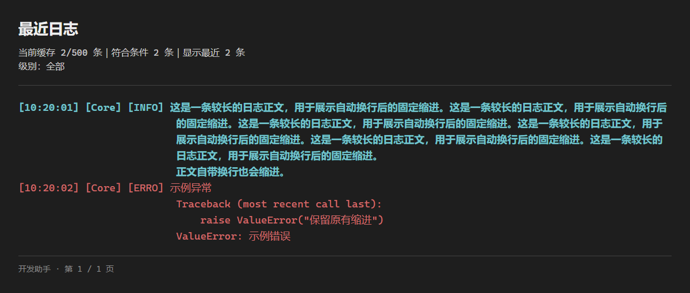
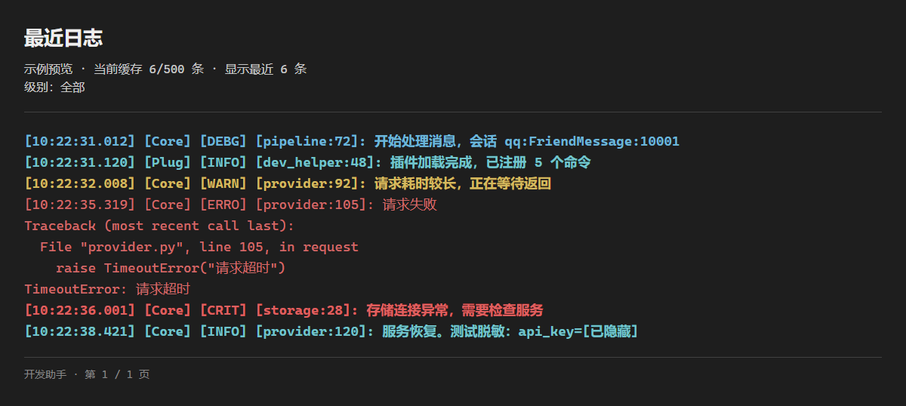
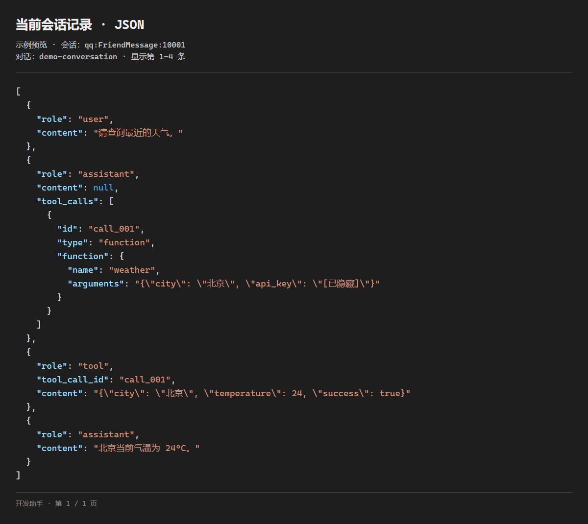
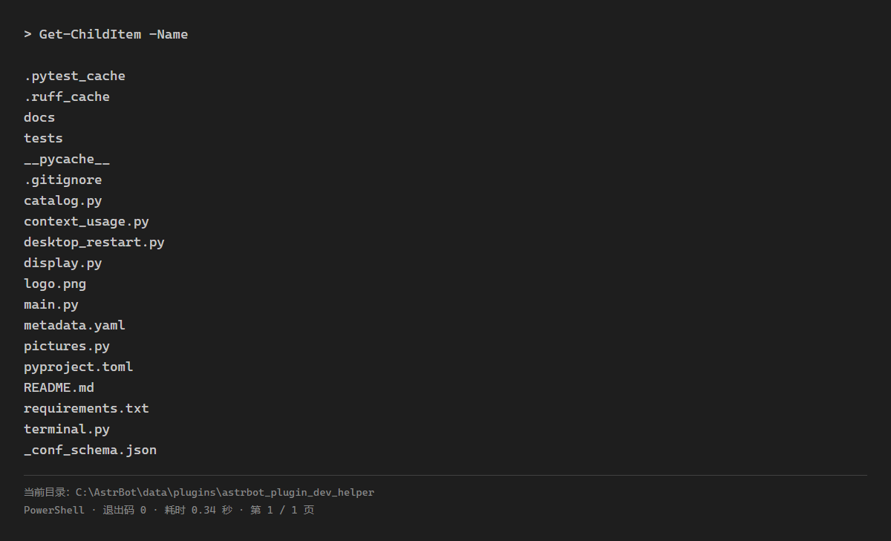
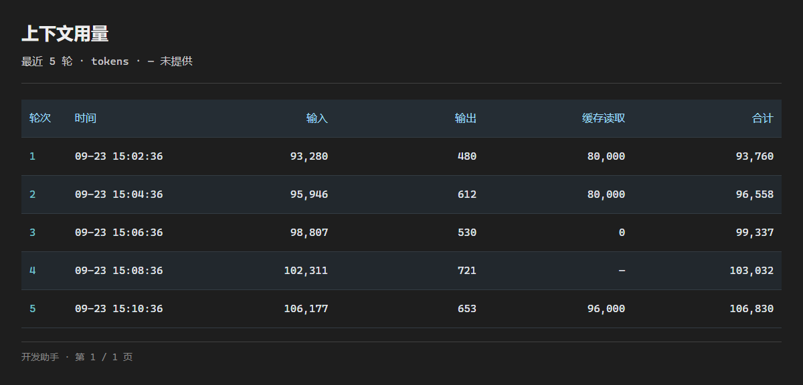
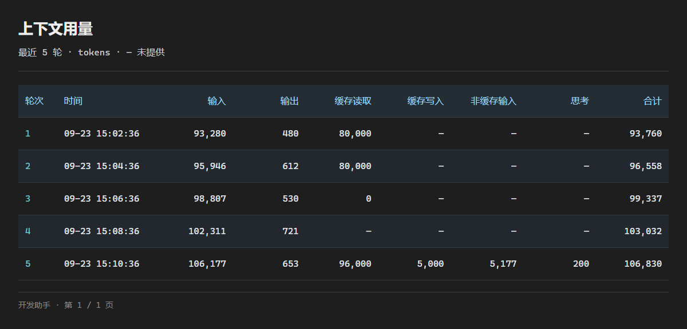

# 开发助手

面向 AstrBot 管理员的开发与排障插件：查看命令和模型工具、读取最近日志与当前会话记录、统计上下文用量，以及执行终端命令、重启程序和卸载插件。

> [!IMPORTANT]
>
> 本插件的部分涉及图片渲染的命令图片依赖于 [浏览器服务 - AstrBot Cloud](https://cloud.astrbot.app/plugin/rytte/astrbot_plugin_browser) 插件。
>
> * `浏览器服务` 插件负责统一启动一个本地无头 Chromium，并为每次渲染提供独立的页面会话。
> * 避免每个依赖浏览器渲染的插件重复配置，重复启动浏览器、减少内存占用，同时保持离线渲染和任务隔离。

> [!TIP]
>
> 本插件提供各类命令工具，如果你希望让模型帮你执行命令或是希望模型能够直接获取命令结果，可以尝试使用 [命令转模型工具 - AstrBot Cloud](https://cloud.astrbot.app/plugin/rytte/astrbot_plugin_command_tools) 插件。
>
> 此插件能将用户命令转化为模型可调用的工具。

## 命令一览

所有命令仅限管理员。标为“当前会话”的命令可以在群内使用，回复对群成员可见。

| 命令 | 功能 | 使用范围 |
| --- | --- | --- |
| `/dev` | 数量概览与命令帮助 | 当前会话 |
| `/dev commands [页码]` | 命令、指令组、别名、权限与启用状态 | 当前会话 |
| `/dev tools [页码]` | 模型工具的来源、说明与参数 | 当前会话 |
| `/dev plugin <插件标识> [页码]` | 指定插件的命令与模型工具 | 当前会话 |
| `/logs [条目数] [--text]` | 最近日志，默认 30 条，可配置 | 仅私聊 |
| `/logs warning [条目数] [--text]` | WARNING、ERROR、CRITICAL 日志 | 仅私聊 |
| `/chatlog [条目数] [--text]` | 当前对话已保存记录，默认 10 条，可配置 | 当前会话 |
| `/ctx [轮数] [--text]` | 当前对话上下文用量，默认 5 轮 | 当前会话 |
| `/plugin remove <插件名> [--all]` | 发起插件卸载，确认后执行 | 仅私聊 |
| `/term <命令>` | 在 AstrBot 所在环境执行系统终端命令 | 仅私聊 |
| `/term enter`、`/term exit` | 开启、关闭点号快捷模式；开启后 `.ls` 等同于 `/term ls` | 仅私聊 |
| `/restart` | 发起重启，确认后执行 | 仅私聊 |

目录每页 20 项，默认第一页，结果附下一页命令。日志条目数、会话记录条目数和用量轮数均为 **1–100**；显式参数优先于默认值。

```text
/dev commands 2
/dev tools
/dev plugin astrbot_plugin_dev_helper
/logs warning 20
/chatlog 10
/ctx 5
```

### 图片与文本

`/logs`、`/chatlog`、`/ctx` 使用相同的输出规则：

| 情况 | 输出方式 |
| --- | --- |
| 正常查询，不带 `--text` | 日志配色图片、会话 JSON 高亮图片或用量表格图片 |
| 浏览器服务不可用、依赖缺失、渲染异常或超时 | 自动回退文本，附上“图片渲染不可用，已改为文本” |
| 参数末尾带 `--text` | 直接输出文本，不检查浏览器服务、不尝试渲染 |
| 权限不足、参数错误、空记录等 | 简短文本提示，不渲染图片 |

```text
/logs --text
/logs warning 20 --text
/chatlog 10 --text
/ctx 5 --text
```

`--text` **只能在参数末尾出现一次**。例如 `/ctx --text 5`、`/logs --text --text` 和未知选项都会明确报错，不静默忽略。

每次查询只读取一份数据，图片与备用文本共用同一份脱敏结果。渲染失败不会重新查询；具体原因记录到日志。全部页面渲染成功后才发送，平台发送失败不会自动补发文本，避免重复输出。

图片宽度为 1200 像素，长行自动换行：日志和 JSON 每页最多 56 行正文，用量表格每页最多 20 轮。渲染超时上限为 **120 秒**，超时后回退文本。图片在内存中生成，不保留日志或会话截图文件，不加载远程脚本、字体或图片。

文本不按字符数截断，分页和查询条数限制仍然生效。文本回复交给 AstrBot 标准流程处理前缀、分段和 QQ 合并转发；关闭自动文本转图片和 Markdown。QQ 的 aiocqhttp 适配器按 `platform_settings.forward_threshold` 判断是否合并转发。

## 效果预览

点击缩略图查看原图。此处仅展示涉及图片渲染命令的例图。

| 功能与说明 | 例图 |
| :--- | :---: |
| **最近日志**<br>`/logs`：长行换行与异常堆栈缩进。 | <a href="docs/previews/logs-indent-1.png"></a> |
| **日志等级与脱敏**<br>展示不同日志等级的配色与密钥脱敏。 | <a href="docs/previews/logs-1.png"></a> |
| **会话记录**<br>`/chatlog`：JSON 高亮与敏感字段脱敏。 | <a href="docs/previews/chatlog-1.png"></a> |
| **终端执行**<br>`/term`：命令与输出置顶，目录和状态信息显示在页脚。 | <a href="docs/previews/term-1.png"></a> |
| **上下文用量**<br>`/ctx`：逐轮 token 用量，区分缺失值与实际返回的 0。 | <a href="docs/previews/ctx-1.png"></a> |
| **更多用量列**<br>展示多列用量数据及缺失值。 | <a href="docs/previews/ctx-all-columns-1.png"></a> |

## 插件配置

在 WebUI 的插件管理中打开“开发助手”配置，修改并保存后由 AstrBot 重载生效。

| 配置项 | 默认值 | 范围 | 说明 |
| --- | --- | --- | --- |
| `chatlog_default_count` | 10 | 1–100 | `/chatlog` 省略条目数时使用，图片与文本模式共用 |
| `logs_default_count` | 30 | 1–100 | `/logs` 及其 `warning` 子命令省略条目数时使用 |
| `terminal_max_pages` | 5 | 1–20 | 终端结果最多发送的图片页数，超出时附完整文本结果 |
| `terminal_timeout` | 60 | 1–600 | 终端执行超时，单位秒；超时后终止进程树 |
| `terminal_max_output_bytes` | 1048576 | 1024–10485760 | 标准输出与错误输出共用的容量上限，默认 1 MiB |

配置项必须是范围内的整数；非法值和未知配置项会明确报错。升级不会覆盖已保存的配置值。浏览器路径由浏览器服务插件管理，本插件不提供输出模式配置。

## 查询说明

### 命令与模型工具

`/dev` 读取注册信息，不执行被查询的命令、自定义过滤器或工具，也不调用模型。

- 命令目录包含内置与插件命令、指令组和别名，继承父指令组的管理员要求与停用状态。
- 工具目录包含内置工具、插件工具和已连接 MCP 服务的工具；未连接 MCP 服务无法提供实时目录。
- Agent 委派入口与嵌套工具一并列出，并注明入口关系；同一工具对象只计一项，不同对象即使同名也分别展示。
- 目录中的启用状态不代表某次请求一定携带该工具，实际行为仍受人设、会话权限和运行时设置影响。
- 插件没有留下可用注册信息时会明确提示，不猜测其命令或工具。

### 日志与会话记录

`/logs` 读取 AstrBot 现有日志缓存，不扫描日志文件，也不能找回重启前已丢失的缓存。`warning` 先筛选级别，再取最近 N 条，按原有顺序输出；异常堆栈属于同一条日志。缓存为空、无匹配日志和日志源不可用会分别提示。

`/chatlog` 只读取当前会话选中对话的已保存记录，验证对话归属并遵循 AstrBot 的群成员独立会话设置，不会创建、切换或修改对话。**条目数不是对话轮数**：用户消息、助手回复、工具调用及工具结果按实际保存条目计数。尚未落库的消息、动态系统提示词及未保存到本地的第三方 Agent 内容可能不在结果中。

### 上下文用量

`/ctx` 展示最近若干轮的输入、输出、缓存读取、缓存写入、思考和合计 token，只显示接口实际提供的字段；明确返回的 0 会保留，缺失值不会当成 0，没有用量时显示“未提供用量”。

需要注意：

- **一轮是一次主 Agent 运行**。工具循环可能请求模型多次，显示的是该轮最后一次请求的用量，不是多次请求的累计消耗。
- 输入可能已包含缓存读取，输出可能已包含单列的思考 token，不应再次相加；输入与输出之和也不是下一轮实时上下文大小。
- 从插件启用后开始采集，覆盖普通成员和管理员触发的内置 Agent 对话；每个对话最多保留最近 100 轮，使用插件 KV 持久化。
- 记录按会话和对话 ID 隔离，`/new`、切换对话不会混用；重启或重载后仍可查询。
- 成功 `/reset` 后清除对应统计；其他方式清空、删除、裁剪或压缩上下文时，在后续查询或请求中同步清理。
- 启用前的逐轮明细无法补回。只有已有合计时展示合计并注明“无明细”；绕过主 Agent 钩子且没有本地记录的外部 Agent 无法提供逐轮统计。

统计保存时间、轮次、用量及关联消息的哈希，不额外保存对话正文。查询不会调用模型，也不会把尚未保存的回复当作已完成轮次。

## 管理操作

以下操作都要求 **管理员私聊**。

### 终端执行

`/term` 使用 AstrBot 进程的系统权限，在其所在机器或容器内执行原生 shell 命令，支持选项、管道、重定向及多行脚本。

```text
/term pwd
/term ls
/term git status
/term cat README.md
/term cd "子目录 with space"
```

- Windows 优先使用 PATH 中的 PowerShell 7（`pwsh`），否则使用 Windows PowerShell；不加载个人 profile，默认抑制进度消息，避免模块初始化的 CLIXML 噪声混入结果；正常输出、错误和退出码仍会保留。Linux/macOS 使用 `/bin/sh`。
- 初始目录沿用 AstrBot 当前会话的本地工具工作区。成功的 `cd` 或 `Set-Location` 会保留到后续命令，按会话和管理员身份隔离，不改变 AstrBot 主进程的工作目录。
- 每次启动独立 shell，**只保留工作目录**，不保留 shell 变量、环境变量修改、函数、别名或后台任务；不支持交互式编辑器和密码输入。
- 工作区设置变化、插件重载或 AstrBot 重启会重置目录；命令是否可用由系统环境和已安装程序决定。

#### 点号快捷模式

```text
/term enter
.ls
.git status
.cd "子目录 with space"
/term pwd
/term exit
```

- 开启后，点号是额外的终端命令前缀，原 `/term <命令>` 始终可用。只移除开头的一个点，命令内部的空格和换行原样保留；例如 `. ./script.sh` 执行 `./script.sh`。
- 模式仅对当前管理员的当前私聊会话生效；普通聊天、其他斜杠命令、群聊及其他用户不受影响。**开启期间，以点号开头的消息会被当作终端命令，请勿用来发送普通文字。**
- **10 分钟无终端操作自动退出**。实际提交执行的点号命令或 `/term <命令>` 会续期，普通聊天、其他命令和重复 `/term enter` 不会续期；自动退出不终止已运行的命令。
- 手动退出必须发送 `/term exit`；`.exit` 只是 shell 的 `exit` 命令，不关闭快捷模式。退出不重置已保留的工作目录。
- 状态只保存在内存中，插件重载或 AstrBot 重启后关闭。已有点号唤醒前缀或点号开头的其他插件命令时拒绝开启，避免抢占；开启后检测到这类冲突也会关闭快捷入口。

图片顶部直接显示原始命令，正文展示合并的标准输出与错误输出，不显示大标题和执行目录。每页页脚显示当前目录、终端类型、退出码、耗时和页码；点号模式有效时额外显示“点号模式”，即使使用原 `/term` 命令也会提醒。长路径自动换行，超时和输出截断用醒目的提示标注。默认最多发送 5 页图片，超出时附上脱敏后的完整 UTF-8 文本结果。附件需要平台支持文件发送，发送后删除本地临时文件。

默认执行超时为 60 秒，输出容量上限为 1 MiB。超时或达到容量上限后终止进程树并注明截断，只能保留终止前已收集的结果；插件卸载时终止仍在运行的终端任务。

执行前浏览器服务不可用时拒绝执行。命令执行后若渲染失败，会说明命令已执行并发送文本附件，**不会为了获取结果重复执行命令**。

### 重启 AstrBot

```text
/restart
/restart confirm
```

同一管理员须在同一私聊的 **60 秒内**确认。普通部署调用 AstrBot 的进程重启功能；Windows 版 AstrBot Desktop 会结束当前桌面应用及后端，再启动同一桌面程序，期间会中断正在运行的任务。

其他系统的 Desktop 模式暂不支持脚本重启。Windows Desktop 重启失败信息写入 `data/logs/desktop_restart.log`。重启后 AstrBot 会重新读取 `data/cmd_config.json`。

### 卸载插件

默认只删除插件文件，保留配置和数据：

```text
/plugin remove <插件名>
/plugin remove <插件名> confirm
```

需要同时删除配置和数据时，两次命令都必须带 `--all`：

```text
/plugin remove <插件名> --all
/plugin remove <插件名> --all confirm
```

同一管理员须在同一私聊的 **60 秒内**按提示确认，不能在确认时更改插件或删除范围。卸载调用 AstrBot WebUI 使用的服务，支持已加载插件名及加载失败插件的目录名；AstrBot 保留插件不能卸载。

## 安全与排障

- **群内可见性**：`/chatlog`、`/ctx` 的结果会发到当前会话，在群内使用时对群成员可见；敏感查询请使用合适的会话。
- **脱敏边界**：图片、文本和终端附件都会遮蔽可识别的密钥、令牌、密码、认证头及内嵌媒体数据；会话中的多媒体使用类型摘要。复杂自由文本中的秘密无法保证全部识别，分享前仍需检查。
- **没有图片**：检查浏览器服务是否启用、浏览器路径、依赖和中文字体；查看 AstrBot 日志中的渲染失败原因。需要立即读取结果时使用 `--text`。
- **没有用量**：检查是否存在插件启用后保存的内置 Agent 对话，以及模型接口是否提供用量；本插件不会用字符数估算 token。
- **命令冲突**：加载时与现有命令或别名重名会拒绝初始化，运行中也会复查；请在插件管理中解决重名问题。
- **系统副作用**：终端执行、重启和卸载不是只读操作。插件没有为 shell 提供沙箱，不要执行来源不明的命令。

## 开发验证

使用原版 AstrBot 源码及其 Python 环境。源码位于相邻的 `AstrBot` 目录时，在插件目录执行：

```powershell
../AstrBot/.venv/Scripts/python.exe -m pytest -q
../AstrBot/.venv/Scripts/ruff.exe check .
../AstrBot/.venv/Scripts/ruff.exe format --check .
```

源码位于其他位置时设置 `ASTRBOT_SOURCE`。测试使用真实事件、命令过滤器和标准消息流水线，运行数据隔离到系统临时目录；平台发送和会话服务使用隔离替身，不连接聊天平台或付费模型。

设置 `PICTURE_TESTS=1` 可启用真实浏览器集成测试，验证分页、中文排版和无网络请求。浏览器由 `ASTRBOT_BROWSER_EXECUTABLE` 指定，未设置时使用 Playwright Chromium；不启用时仅跳过这些集成测试。真实 QQ 等平台的联调仍需在部署环境中验证。
